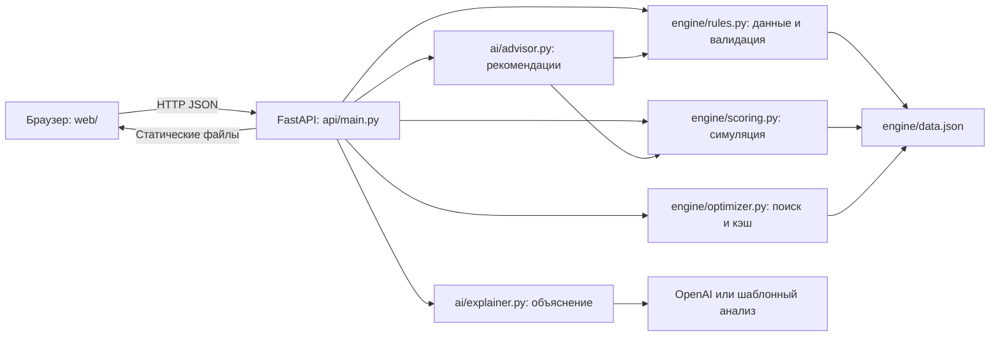

# Аким на 5 часов

Учебный AI-симулятор управления Астаной: выберите ровно пять мер из четырнадцати при бюджете 100 и оцените последствия для пяти районов. Проект показывает проблему ограниченных ресурсов: рост среднего качества жизни не всегда решает проблемы самого слабого района.

Движок рассчитывает Astana Quality of Life Score, эффекты, синергии и вклад мер. AI объясняет готовые результаты; численные расчёты и подбор рекомендаций выполняет Python.

## Запуск

Нужен Python 3.11+ с pip. Из корня репозитория:

```bash
python3 -m pip install -r requirements.txt && python3 -m uvicorn api.main:app --reload
```

Откройте http://localhost:8000. Сборка фронтенда не требуется. При необходимости сначала создайте и активируйте виртуальное окружение: `python3 -m venv .venv && source .venv/bin/activate`.

Для AI скопируйте `.env.example` в `.env` и задайте переменные:

| Переменная | Назначение |
| --- | --- |
| `OPENAI_API_KEY` | Ключ доступа к OpenAI; необязателен |
| `OPENAI_MODEL` | Модель объяснения; текущее значение по умолчанию в коде — `gpt-6-sol` |

Модель должна быть доступна вашему аккаунту и поддерживать используемый формат JSON. Без ключа, при ошибке обращения к AI или некорректном ответе сервер использует шаблонный анализ (`source: "fallback"`). Расчёты, сравнение и оптимизатор работают без ключа. Зависимость `openai` всё равно должна быть установлена. Не добавляйте `.env` в git.

## Интерфейс

- **Город:** пять районов, десять показателей и базовый Score. Значения строго ниже 40 выделены красным и знаком `!`.
- **Решения:** каталог по направлениям, выбор района, текущий бюджет и серверная валидация при каждом изменении. Расчёт доступен только после успешной проверки.
- **Результат:** Score до/после, дельта, таблица показателей районов, вклад мер и синергии; объяснение с итогом, сильными сторонами, рисками, последствиями, компромиссами и рекомендациями.
- **Сравнение:** сохранение до трёх рассчитанных сценариев и сравнение двух или трёх через API. Сценарии хранятся в памяти вкладки до перезагрузки.
- **Оптимизатор:** пять лучших наборов и загрузка любого из них в решения с повторной валидацией.
- **События:** информационный экран-заглушка. Движок и `AGENTS.md` события уже поддерживают (EV1–EV5, необязательный `event_id`), но в `api/main.py` нет ни `GET /api/events`, ни параметра `event_id`, поэтому интерфейс их не запрашивает и бюджет остаётся 100.

При недоступности API интерфейс показывает ошибку. Подмена ответов тестовыми данными не реализована; в том числе `?mock=1` не включает отдельный режим.

## Архитектура и технологии

Python, FastAPI, uvicorn, OpenAI SDK, python-dotenv, pytest. Фронтенд — статические HTML/CSS/JavaScript без сборки и без Chart.js. Шрифт Manrope загружается из Google Fonts; при недоступности сети используется системный шрифт.



| Метод и путь | Назначение |
| --- | --- |
| `GET /api/state` | Бюджет, исходные районы, меры, веса и базовый Score |
| `POST /api/validate` | Проверка `{ "decisions": [...] }` |
| `POST /api/simulate` | Расчёт валидного набора |
| `POST /api/explain` | Симуляция, анализ и источник `ai` / `fallback` |
| `POST /api/compare` | Сравнение `{ "scenarios": [{ "name": "Название", "decisions": [...] }] }` |
| `GET /api/optimize?top=5` | Лучшие наборы; API допускает `top` от 1 до 100 |
| `GET /` | Интерфейс; `/app.js` и `/styles.css` — статические ресурсы |

Районная мера: `{ "measure_id": "M7", "district": "Нура" }`. Городская: `{ "measure_id": "M12", "district": null }`.

Невалидный набор не получает Score. Текущая реализация FastAPI возвращает HTTP 422 с причинами в `detail.errors`; интерфейс также понимает `errors` на верхнем уровне. Рекомендации текущего API содержат объекты с `text`, `replace`, `score`, `delta_score`; интерфейс отображает `text` и поддерживает строки из контракта.

## Формула и правила

Горизонт `H = 8` кварталов. Все показатели в диапазоне 0–100, больше — лучше. Для района `d` и показателя `k`:

```text
I'_dk = clip(I_dk + Σ эффект_mk × (8 − L_m) / 8 + синергии, 0, 100)
D_d = Σ w_k × I'_dk
D_avg = Σ pop_d × D_d
Score = 0.7 × D_avg + 0.3 × min(D_d) − N_crit
```

`L_m` — лаг меры; `N_crit` — число пар «район × показатель», у которых итоговое значение строго меньше 40. Городские меры действуют на все пять районов. Бонусы синергий лагом не масштабируются.

| Показатель | Смысл | Вес |
| --- | --- | --- |
| T1 | Разгрузка дорог | 0.10 |
| T2 | Доступность общественного транспорта | 0.10 |
| E1 | Озеленение | 0.09 |
| E2 | Качество воздуха | 0.11 |
| S1 | Школы и детсады | 0.11 |
| S2 | Поликлиники | 0.11 |
| B1 | Безопасность улиц | 0.09 |
| B2 | Безопасность дорожного движения | 0.09 |
| C1 | Надёжность ЖКХ | 0.10 |
| C2 | Скорость решения обращений | 0.10 |

Доли населения: Есиль — 0.27, Алматы — 0.24, Сарыарка — 0.20, Байконур — 0.13, Нура — 0.16. Исходные показатели и все четырнадцать мер с ценами, лагами и эффектами находятся в `engine/data.json` и отображаются в интерфейсе.

Правила валидации:

1. Суммарная стоимость не больше 100.
2. Ровно пять мер.
3. Повторять одну меру нельзя, даже в разных районах.
4. Для типа `R` обязателен один из пяти известных районов; для `C` район должен быть `null`.
5. Не больше двух мер из одного направления: транспорт, экология, соцсфера, безопасность, сервисы.
6. M1 и M3 несовместимы в любых районах; M4 и M7 несовместимы в одном районе; M5 и M13 несовместимы в одном районе.
7. При нарушениях возвращается список причин на русском без Score.
8. Порядок мер не влияет на результат.

Синергии при выборе обеих мер:

| Пара | Бонус | Где действует |
| --- | --- | --- |
| M1 + M2 | T1 +2 | Район M1 |
| M10 + M12 | B1 +2 | Район M10 |
| M5 + M6 | E2 +2 | Район M5 |

Вклад меры — `Score(полный набор) − Score(набор без этой меры)`. Это предельный вклад, поэтому сумма вкладов не обязана совпадать с общей дельтой. Движок считает без округления; API округляет числовые ответы до двух знаков (`round_floats` в `api/main.py`), интерфейс отображает их с той же точностью.

## Три контрольных сценария

| Сценарий | Решения | Ожидаемый результат из AGENTS.md |
| --- | --- | --- |
| Базовый | Нет мер; `simulate([])` внутри движка | Score **52.55768**, D_avg **56.8624**, N_crit **2**, стоимость **0** |
| Поддержка районов | M7 Нура, M8 Нура, M10 Нура, M12 город, M5 Сарыарка | Валиден, Score **56.54307**, стоимость **95**, остаток **5** |
| Экономный | M9 Нура, M11 Нура, M10 Есиль, M12 город, M4 Сарыарка | Валиден, стоимость **61**, остаток **39**; контрольный Score для этого набора в AGENTS.md не задан |

Пустой набор допустим для внутреннего базового расчёта, но `POST /api/simulate` отклоняет его: для пользовательской программы нужны пять мер. Базовый Score доступен через `/api/state`.

## Проверки

```bash
python3 -m pytest -q
```

`tests/test_engine.py` проверяет контрольные числа, валидацию, независимость от порядка, корректность и кэширование оптимизатора, а также время первого поиска меньше 10 секунд. Текущий допуск контрольных чисел в тестах — 0.01.

Проверка синтаксиса фронтенда при наличии Node.js:

```bash
node --check web/app.js
```

Для ручной проверки запустите сервер, откройте http://localhost:8000, соберите контрольный набор стоимостью 95, проверьте Score 56,54 и шаблонный анализ без ключа. Сохраните два разных сценария, сравните их и загрузите набор оптимизатора. Удалите одну меру: кнопка расчёта должна стать недоступной, а валидатор — показать причину.

## Ограничения

- Это учебная модель с фиксированными данными, линейными эффектами и заданными лагами, а не прогноз реального развития Астаны.
- Расчёт показывает состояние на горизонте восьми кварталов, без поквартальной динамики и случайных событий.
- Оптимизатор максимизирует только заданную формулу Score. Кэш хранится в памяти процесса; время первого поиска зависит от машины.
- Нет аккаунтов, базы данных и постоянного хранения сценариев. Ограничение в три сохранённых сценария реализовано в интерфейсе.
- AI может быть недоступен; шаблонный анализ явно помечается. Рекомендации перебирают замены одной меры и не гарантируют глобально лучший набор.
- События реализованы только в движке (`engine/events.json`, `engine/events.py`): пять событий EV1–EV5 со штрафом бюджета 5–15. В API и интерфейс они не проброшены, параметр `event_id` не отправляется, бюджет остаётся 100.
