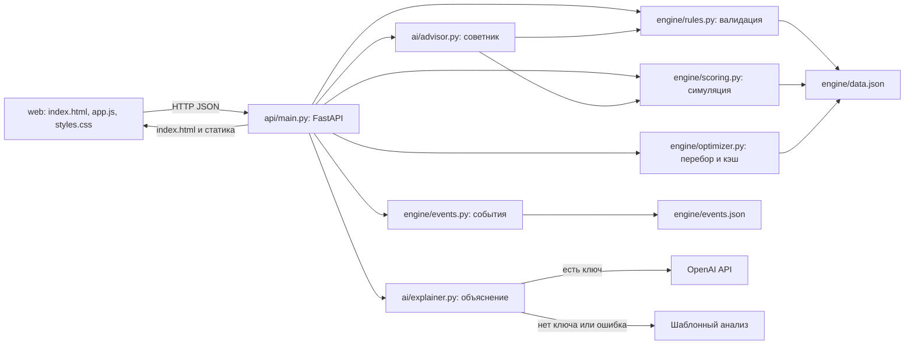

# Аким на 5 часов

Учебный AI-симулятор управления Астаной: выберите ровно пять мер из четырнадцати при бюджете 100 и оцените последствия для пяти районов. Проект показывает проблему ограниченных ресурсов: рост среднего качества жизни не всегда решает проблемы самого слабого района.

Движок рассчитывает Astana Quality of Life Score, эффекты, синергии и вклад мер. AI объясняет готовые результаты; численные расчёты и подбор рекомендаций выполняет Python.

**Проблема.** Бюджета хватает на малую часть городских нужд, а рост среднего показателя уживается с деградацией отдельного района. Симулятор делает компромисс измеримым: Score на 70 % складывается из среднего по городу, на 30 % — из оценки самого слабого района и штрафуется за каждый критический показатель.

**Для кого.** Для участников хакатонов и студентов, разбирающих городское планирование; для преподавателей как учебный стенд по распределению ограниченного бюджета; для разработчиков как пример связки «детерминированный движок считает, LLM только объясняет».

## Что реализовано

Обязательная часть:

- Каталог из 14 мер по пяти направлениям, выбор ровно пяти мер при бюджете 100, районные и городские меры.
- Валидация набора по восьми правилам с причинами отказа на русском.
- Расчёт Astana Quality of Life Score: эффекты с лагом, синергии, ограничение 0–100, критические показатели, вклад каждой меры.
- Объяснение результата: `POST /api/explain` возвращает итог, сильные стороны, риски, последствия, компромиссы и рекомендации.

Дополнительные возможности:

| Возможность | Состояние |
| --- | --- |
| Оптимизатор | Есть. `engine/optimizer.py`, `GET /api/optimize`, экран «05 · Оптимизатор»; перебор валидных наборов с кэшем |
| Сравнение сценариев | Есть. До трёх сохранённых сценариев, `POST /api/compare`, экран «04 · Сравнение» |
| Советник | Есть. `ai/advisor.py` перебирает замену одной меры и проверяет каждый вариант движком; выдаёт до трёх предложений в поле `recommendations` |
| События | Есть во всех слоях: `engine/events.json`, `engine/events.py`, `GET /api/events`, необязательный `event_id` в запросах, экран «06 · События» с выбором одного события из пяти |
| Визуализация | Есть. Полосы-индикаторы показателей, полоса бюджета, тепловые карты районов «до» и «после» с дельтами и таблицы «до → после». Всё на чистом CSS, библиотек графиков в проекте нет |
| Отчёт | Есть. Кнопка «Сформировать отчёт» открывает печатную версию в новом окне: событие, Score, меры, главные изменения по районам и анализ; сохранение в PDF через диалог печати браузера. Выгрузки в CSV или JSON нет |

## Сценарий пользователя

1. Экран «01 · Город» показывает пять районов, десять показателей и базовый Score 52.56; критические значения ниже 40 выделены красным.
2. При желании на экране «06 · События» выбирается одно из пяти событий. Оно ухудшает исходные показатели и уменьшает бюджет; выбор сразу перепроверяет уже собранный набор. Кнопка «Без события» возвращает базовый режим.
3. На экране «02 · Решения» пользователь отмечает меры и выбирает район для районных мер. Кнопка «Демо-сценарий» подставляет готовый контрольный набор стоимостью 95.
4. После каждого изменения интерфейс отправляет набор в `POST /api/validate` вместе с выбранным событием и показывает доступный бюджет, остаток и список нарушений.
5. Кнопка расчёта включается только для валидного набора; она вызывает `POST /api/simulate`.
6. Экран «03 · Результат» показывает Score до и после, дельту, тепловые карты районов «до» и «после», таблицу показателей, вклад каждой меры и сработавшие синергии.
7. Следом интерфейс запрашивает `POST /api/explain` и выводит анализ с пометкой, получен он от AI или это шаблонный разбор.
8. Готовый расчёт можно выгрузить кнопкой «Сформировать отчёт» — откроется печатная версия для сохранения в PDF.
9. Сценарий можно сохранить (до трёх, вместе с его событием) и сравнить на экране «04», а на экране «05» запросить у оптимизатора лучшие наборы для текущего события и загрузить любой из них обратно в решения.

## Запуск

Нужен Python 3.11+ с pip. Одной командой из корня репозитория:

```bash
./run.sh
```

Скрипт создаёт `.venv`, если её нет, ставит зависимости из `requirements.txt`, копирует `.env.example` в `.env`, если `.env` отсутствует, и запускает `uvicorn api.main:app` на http://localhost:8000. Порт и адрес можно переопределить: `PORT=9000 ./run.sh`.

Тот же запуск вручную:

```bash
python3 -m venv .venv
source .venv/bin/activate
python3 -m pip install -r requirements.txt
cp .env.example .env
python3 -m uvicorn api.main:app --reload
```

Откройте http://localhost:8000. Сборка фронтенда не требуется.

Для AI скопируйте `.env.example` в `.env` и задайте переменные:

| Переменная | Назначение |
| --- | --- |
| `OPENAI_API_KEY` | Ключ доступа к OpenAI; необязателен |
| `OPENAI_MODEL` | Модель объяснения; текущее значение по умолчанию в коде — `gpt-6-sol` |

Модель должна быть доступна вашему аккаунту и поддерживать используемый формат JSON. Без ключа, при ошибке обращения к AI или некорректном ответе сервер использует шаблонный анализ (`source: "fallback"`). Расчёты, сравнение и оптимизатор работают без ключа. Зависимость `openai` всё равно должна быть установлена. Не добавляйте `.env` в git.

## Демо за 5 минут

Запустите `./run.sh` и откройте http://localhost:8000. Все числа ниже — фактический ответ API, интерфейс показывает их с двумя знаками.

**1. Точка отсчёта (30 секунд).** Экран «01 · Город». Базовый индекс — **52,56**. Самый слабый район — Нура с оценкой **49,18** и двумя красными показателями: школы и детсады **38**, поликлиники **35**. Это и есть цель программы.

**2. Готовая программа (1 минута).** Экран «02 · Решения» → кнопка «Демо-сценарий». Подставится контрольный набор: школа и детсад в Нуре (M7), центр семейного здоровья в Нуре (M8), освещение и камеры в Нуре (M10), цифровая платформа обращений на весь город (M12), чистое топливо в Сарыарке (M5). Панель бюджета покажет **95 / 100**, остаток **5**, «Выбрано мер: 5 / 5» и зелёную строку «Набор готов к расчёту».

**3. Результат (1 минута).** Кнопка «Рассчитать результат». Ожидаемые числа:

| Показатель | Значение |
| --- | --- |
| Score | **52,56 → 56,54**, дельта **+3,98** |
| Критические показатели | **0** (было 2) |
| Самый слабый район | Нура, **52,96** (было 49,18) |
| Школы и детсады в Нуре | 38 → **48** |
| Поликлиники в Нуре | 35 → **43,75** |
| Вклады мер | M7 **+1,45**, M8 **+1,40**, M10 **+0,53**, M12 **+0,51**, M5 **+0,17** |
| Синергия | M10 + M12 → безопасность улиц **+2** в Нуре |

Главное здесь — не рост среднего, а то, что оба критических показателя Нуры поднялись выше порога 40. Ниже блок объяснения: «Анализ AI», если задан `OPENAI_API_KEY`, иначе «Шаблонный анализ · без AI». Числа в обоих случаях одинаковые.

**4. Совет движка (1 минута).** В блоке «Рекомендации» первым пунктом будет «Заменить M5 на M3 (Линия ЛРТ, Нура): +0,67». Снимите галочку с «Перевод частного сектора на чистое топливо», отметьте «Линия ЛРТ» и выберите район Нура. Пересчитайте: Score станет **57,21** при стоимости **100** и остатке **0**. Советник не угадывает: каждое предложение он предварительно прогоняет через валидацию и симуляцию движка.

**5. Событие ломает план (1 минута).** Экран «06 · События» → «Прорыв теплосети» (Алматы, надёжность ЖКХ **−18**, скорость обращений **−8**, на ликвидацию **12**). Доступный бюджет падает до **88**, базовый Score с событием — **51,12**. Вернитесь на «02 · Решения», нажмите «Демо-сценарий» и посмотрите на валидацию:

> Стоимость набора 95 превышает бюджет 88 на 7: из-за события «Прорыв теплосети» на ликвидацию ушло 12 из 100

Кнопка расчёта заблокирована: в кризис прежняя программа не помещается в бюджет.

**6. Оптимизатор (1 минута).** Экран «05 · Оптимизатор» с тем же событием → «Найти лучший набор». Лучший вариант — **Score 56,09** при стоимости **86** из 88: центр семейного здоровья в Нуре, спорт-хабы в Нуре, освещение и камеры в Нуре, модернизация тепло- и водосетей в Алматы и аварийные бригады ЖКХ на весь город. Движок сам добавил ремонт сетей в пострадавшем районе. Нажмите «Загрузить этот набор в решения» — валидация пройдёт, расчёт сработает.

Снимите событие кнопкой «Без события» и запросите оптимум ещё раз: **Score 57,24** при стоимости **98** — умные светофоры, ЛРТ в Нуре, центр семейного здоровья в Нуре, спорт-хабы в Нуре и аварийные бригады ЖКХ.

**7. Отчёт (30 секунд).** На экране «03 · Результат» нажмите «Сформировать отчёт». В новом окне откроется печатная версия: событие, Score, список мер, главные изменения по районам и анализ. Кнопка «Печать / сохранить в PDF» открывает диалог печати браузера.

## Интерфейс

Интерфейс собран из трёх файлов: `web/index.html`, `web/app.js` (без внешних зависимостей) и `web/styles.css`. Это одна страница с шестью экранами; активный экран переключается кнопками навигации и запоминается в хеше URL, поэтому `http://localhost:8000/#optimizer` открывает нужный раздел сразу.

- **01 · Город:** пять карточек районов, по десять показателей с полосой-индикатором. Значения строго ниже 40 выделены красным и знаком `!`.
- **02 · Решения:** каталог мер, сгруппированный по пяти направлениям, с ценой, лагом и эффектами; выпадающий список района для районных мер. Панель бюджета показывает выбранное событие, стоимость, остаток и счётчик «N / 5»; после каждого изменения набор уходит в `POST /api/validate`, а кнопка расчёта остаётся заблокированной до успешной проверки. Кнопка «Демо-сценарий» подставляет контрольный набор стоимостью 95, «Сбросить выбор» очищает программу.
- **03 · Результат:** блок выбранного события, Score до и после, дельта, бюджет, число критических показателей и самый слабый район; две тепловые карты районов («до мер» и «после мер» с дельтой по каждой ячейке, цвет по значению, критические значения помечены отдельно), таблица «до → после», таблица вкладов мер, список сработавших синергий и блок анализа с пометкой «Анализ AI» или «Шаблонный анализ · без AI». Кнопка «Сформировать отчёт» открывает печатную версию расчёта в новом окне.
- **04 · Сравнение:** сохранение до трёх рассчитанных сценариев с произвольными названиями; каждый сценарий помнит своё событие, и таблица сравнения показывает его отдельной колонкой. Сценарии живут в памяти вкладки и исчезают при перезагрузке.
- **05 · Оптимизатор:** пять лучших наборов от `GET /api/optimize?top=5` с учётом выбранного события; над списком показан текущий контекст «событие · доступный бюджет». Любой набор загружается обратно в решения с повторной валидацией.
- **06 · События:** карточки всех пяти событий с описанием, затронутым районом, штрафом бюджета и эффектами. Выбор события перепроверяет текущий набор и сбрасывает результаты оптимизатора; кнопка «Без события» возвращает бюджет 100, «Обновить события» повторяет загрузку `GET /api/events`. Если список недоступен, остальные экраны продолжают работать без события.

Запросы ограничены по времени: 10 секунд для списка событий, 15 секунд для загрузки состояния и валидации, 90 секунд для расчёта, объяснения, сравнения и оптимизатора. Ошибка сети или сервера показывается отдельным блоком, у неудачной валидации есть кнопка повтора. Весь текст из ответов экранируется перед вставкой в разметку. Вёрстка перестраивается на ширинах 1100 и 700 пикселей, анимации отключаются при `prefers-reduced-motion`. Подмена ответов тестовыми данными не реализована; в том числе `?mock=1` не включает отдельный режим.

## Архитектура и технологии

Python, FastAPI, uvicorn, OpenAI SDK, python-dotenv, pytest. Фронтенд — статические HTML/CSS/JavaScript без сборки и без Chart.js. Шрифт Manrope загружается из Google Fonts; при недоступности сети используется системный шрифт.



Принцип: **числа считает только движок, AI их объясняет**. `engine/` не знает ни про HTTP, ни про OpenAI и не содержит ничего, кроме стандартной библиотеки. `api/main.py` вызывает движок, получает готовый результат и передаёт его в `ai/` уже посчитанным. Модель не вычисляет Score и не предлагает наборы «от себя»: советник из `ai/advisor.py` проверяет каждое своё предложение через `validate` и `simulate`. Поэтому при недоступности AI цифры и рекомендации остаются прежними, меняется только текст объяснения.

| Метод и путь | Назначение |
| --- | --- |
| `GET /api/state` | Бюджет, районы с базовой оценкой, меры, веса и базовый Score |
| `GET /api/events` | Все пять событий |
| `POST /api/validate` | Проверка `{ "decisions": [...], "event_id": null }` |
| `POST /api/simulate` | Расчёт валидного набора |
| `POST /api/explain` | Симуляция, анализ и источник `ai` / `fallback` |
| `POST /api/compare` | Сравнение `{ "scenarios": [{ "name": "Название", "decisions": [...], "event_id": null }] }` |
| `GET /api/optimize?top=5&event_id=EV1` | Лучшие наборы; `top` от 1 до 100, `event_id` необязателен |
| `GET /` | Интерфейс; `/app.js` и `/styles.css` — статические ресурсы |

Поле `event_id` необязательно во всех телах запросов и в параметрах оптимизатора: без него расчёт идёт по базовому бюджету 100. Неизвестный `event_id` даёт 422 с текстом ошибки.

```bash
curl -s http://localhost:8000/api/simulate \
  -H 'Content-Type: application/json' \
  -d '{"decisions": [
        {"measure_id": "M7", "district": "Нура"},
        {"measure_id": "M8", "district": "Нура"},
        {"measure_id": "M10", "district": "Нура"},
        {"measure_id": "M12", "district": null},
        {"measure_id": "M5", "district": "Сарыарка"}
      ]}'
```

Ответ содержит `"score": 56.54`, `"base_score": 52.56`, `"total_cost": 95` и разбор по районам. Тот же набор с `"event_id": "EV1"` вернёт 422: из-за события доступный бюджет падает до 88.

Районная мера: `{ "measure_id": "M7", "district": "Нура" }`. Городская: `{ "measure_id": "M12", "district": null }`.

Невалидный набор не получает Score. Текущая реализация FastAPI возвращает HTTP 422 с причинами в `detail.errors`; интерфейс также понимает `errors` на верхнем уровне. Рекомендации текущего API содержат объекты с `text`, `replace`, `score`, `delta_score`; интерфейс отображает `text` и поддерживает строки из контракта.

## Структура проекта

```text
.
├── run.sh                 запуск одной командой: venv, зависимости, .env, uvicorn
├── requirements.txt       зависимости Python
├── .env.example           шаблон переменных окружения
├── AGENTS.md              правила разработки и контракт между модулями
├── README.md              этот файл
├── engine/                расчёты, только стандартная библиотека
│   ├── data.json          районы, показатели, веса, 14 мер, синергии, несовместимости
│   ├── events.json        пять событий EV1–EV5
│   ├── rules.py           load_data и validate: восемь правил проверки
│   ├── scoring.py         simulate: эффекты, синергии, Score, вклады мер
│   ├── optimizer.py       optimize: перебор валидных наборов с кэшем
│   ├── events.py          list_events и get_event
│   └── __init__.py        экспорт load_data, validate, simulate, optimize, list_events, get_event
├── api/
│   └── main.py            FastAPI: эндпоинты, округление до двух знаков, отдача web/
├── ai/
│   ├── explainer.py       объяснение результата через OpenAI и шаблонный разбор
│   └── advisor.py         советник: перебор замены одной меры с проверкой движком
├── web/
│   ├── index.html         разметка шести экранов
│   ├── app.js             состояние, запросы к API, рендеринг
│   └── styles.css         оформление, тепловые карты, печатная версия отчёта
└── tests/
    ├── test_engine.py     99 тестов движка
    └── test_api.py        79 тестов HTTP-эндпоинтов
```

## Данные

Все исходные данные лежат в `engine/data.json` и не меняются во время работы. Бюджет 100, горизонт 8 кварталов, десять показателей со шкалой 0–100.

Районы, доли населения и исходные показатели:

| Район | Доля населения | Базовая оценка | T1 | T2 | E1 | E2 | S1 | S2 | B1 | B2 | C1 | C2 |
| --- | --- | --- | --- | --- | --- | --- | --- | --- | --- | --- | --- | --- |
| Есиль | 0.27 | 62.99 | 45 | 62 | 68 | 72 | 48 | 55 | 78 | 60 | 75 | 70 |
| Алматы | 0.24 | 57.06 | 40 | 75 | 50 | 55 | 60 | 65 | 62 | 52 | 50 | 60 |
| Сарыарка | 0.2 | 54.65 | 50 | 70 | 42 | 40 | 62 | 68 | 58 | 55 | 45 | 55 |
| Байконур | 0.13 | 56.63 | 52 | 68 | 55 | 50 | 58 | 60 | 52 | 58 | 55 | 58 |
| Нура | 0.16 | 49.18 | 55 | 40 | 45 | 65 | 38 | 35 | 55 | 50 | 60 | 50 |

Четырнадцать мер. Тип определяет охват: городская мера действует на все пять районов, районная — только на выбранный. Лаг измеряется в кварталах и уменьшает эффект множителем `(8 − лаг) / 8`.

| ID | Направление | Название | Тип | Стоимость | Лаг | Эффекты |
| --- | --- | --- | --- | --- | --- | --- |
| M1 | Транспорт | Выделенные полосы для автобусов | один район | 18 | 2 | T1 +6, T2 +9 |
| M2 | Транспорт | Умные светофоры | весь город | 22 | 2 | T1 +4, B2 +3 |
| M3 | Транспорт | Линия ЛРТ | один район | 30 | 4 | T1 +16, T2 +20, E2 +4 |
| M4 | Экология | Парк / сквер | один район | 15 | 2 | E1 +12, E2 +3, B1 +2 |
| M5 | Экология | Перевод частного сектора на чистое топливо | один район | 25 | 3 | E2 +14, C1 +4 |
| M6 | Экология | Городская программа озеленения | весь город | 20 | 4 | E1 +5, E2 +3 |
| M7 | Соцсфера | Школа + детсад | один район | 24 | 3 | S1 +16 |
| M8 | Соцсфера | Центр семейного здоровья | один район | 20 | 3 | S2 +14 |
| M9 | Соцсфера | Дворовые спорт-хабы | один район | 10 | 1 | S1 +3, S2 +3, B1 +3 |
| M10 | Безопасность | Освещение и камеры | один район | 12 | 1 | B1 +12, B2 +2 |
| M11 | Безопасность | Безопасные переходы и школьные зоны | один район | 10 | 1 | B2 +12, T1 -2 |
| M12 | Сервисы | Единая цифровая платформа обращений | весь город | 14 | 1 | C2 +5 |
| M13 | Сервисы | Модернизация тепло- и водосетей | один район | 28 | 4 | C1 +18, E2 +2 |
| M14 | Сервисы | Аварийные бригады ЖКХ | весь город | 16 | 1 | C1 +5, C2 +2 |

Несовместимости:

| Пара | Ограничение |
| --- | --- |
| M1 и M3 | Нельзя выбирать вместе ни в каких районах |
| M4 и M7 | Нельзя выбирать в одном районе |
| M5 и M13 | Нельзя выбирать в одном районе |

Синергии описаны ниже, в разделе «Формула и правила».

## Формула и правила

Горизонт `H = 8` кварталов. Все показатели в диапазоне 0–100, больше — лучше. Для района `d` и показателя `k`:

```text
I'_dk = clip(I_dk + Σ эффект_mk × (8 − L_m) / 8 + синергии, 0, 100)
D_d = Σ w_k × I'_dk
D_avg = Σ pop_d × D_d
Score = 0.7 × D_avg + 0.3 × min(D_d) − N_crit
```

`L_m` — лаг меры; `N_crit` — число пар «район × показатель», у которых итоговое значение строго меньше 40. Городские меры действуют на все пять районов. Бонусы синергий лагом не масштабируются.

| Показатель | Смысл | Вес |
| --- | --- | --- |
| T1 | Разгрузка дорог | 0.10 |
| T2 | Доступность общественного транспорта | 0.10 |
| E1 | Озеленение | 0.09 |
| E2 | Качество воздуха | 0.11 |
| S1 | Школы и детсады | 0.11 |
| S2 | Поликлиники | 0.11 |
| B1 | Безопасность улиц | 0.09 |
| B2 | Безопасность дорожного движения | 0.09 |
| C1 | Надёжность ЖКХ | 0.10 |
| C2 | Скорость решения обращений | 0.10 |

Доли населения: Есиль — 0.27, Алматы — 0.24, Сарыарка — 0.20, Байконур — 0.13, Нура — 0.16. Исходные показатели и все четырнадцать мер с ценами, лагами и эффектами находятся в `engine/data.json` и отображаются в интерфейсе.

Правила валидации:

1. Суммарная стоимость не больше 100.
2. Ровно пять мер.
3. Повторять одну меру нельзя, даже в разных районах.
4. Для типа `R` обязателен один из пяти известных районов; для `C` район должен быть `null`.
5. Не больше двух мер из одного направления: транспорт, экология, соцсфера, безопасность, сервисы.
6. M1 и M3 несовместимы в любых районах; M4 и M7 несовместимы в одном районе; M5 и M13 несовместимы в одном районе.
7. При нарушениях возвращается список причин на русском без Score.
8. Порядок мер не влияет на результат.

Синергии при выборе обеих мер:

| Пара | Бонус | Где действует |
| --- | --- | --- |
| M1 + M2 | T1 +2 | Район M1 |
| M10 + M12 | B1 +2 | Район M10 |
| M5 + M6 | E2 +2 | Район M5 |

Вклад меры — `Score(полный набор) − Score(набор без этой меры)`. Это предельный вклад, поэтому сумма вкладов не обязана совпадать с общей дельтой. Движок считает без округления; API округляет числовые ответы до двух знаков (`round_floats` в `api/main.py`), интерфейс отображает их с той же точностью.

## События

Событие — неожиданная городская ситуация, требующая перераспределения бюджета. Данные в `engine/events.json`, доступны через `GET /api/events`, `list_events()` и `get_event(event_id)`.

Событие делает две вещи. Во-первых, ухудшает исходные показатели: сдвиги применяются к значениям **до** мер и, в отличие от эффектов мер, лагом не масштабируются. Во-вторых, забирает часть бюджета на ликвидацию последствий, поэтому доступный бюджет становится `100 − budget_penalty`, и дорогой набор может перестать проходить проверку.

| ID | Событие | Где | Эффекты | Штраф бюджета | Доступный бюджет | Базовый Score |
| --- | --- | --- | --- | --- | --- | --- |
| EV1 | Прорыв теплосети | Алматы | C1 -18, C2 -8 | −12 | 88 | 51.12 |
| EV2 | Смоговый эпизод | Сарыарка | E2 -12 | −8 | 92 | 51.37 |
| EV3 | Рост числа ДТП у школ | Нура | B2 -14 | −5 | 95 | 51.04 |
| EV4 | Наплыв новосёлов и переполнение школ | Есиль | S1 -12, T1 -8 | −10 | 90 | 50.16 |
| EV5 | Авария на мосту | весь город | T1 -10 | −15 | 85 | 49.56 |

Базовый Score в таблице — это оценка города с событием, но без мер; для сравнения базовый Score без события равен 52.56. Например, контрольный набор стоимостью 95 проходит проверку без события и при EV3 (бюджет 95), но отклоняется при EV1, EV4 и EV5, а также при EV2, где бюджет падает до 92.

Параметр `event_id` необязателен на всех уровнях: движок, API и интерфейс без него считают базовый сценарий с бюджетом 100 и теми же числами, что и раньше. Неизвестный идентификатор вызывает `ValueError` в движке и 422 в API.

## AI: объяснение и советник

Разделение ролей жёсткое: **движок считает числа, AI только описывает готовый результат словами**.

`ai/explainer.py` отправляет в OpenAI уже посчитанный и округлённый JSON. Модель берётся из переменной `OPENAI_MODEL`, значение по умолчанию в коде — `gpt-6-sol`. Защита от выдуманных чисел состоит из трёх слоёв:

1. Системная инструкция прямо запрещает придумывать что-либо сверх входных данных и требует только JSON с полями `summary`, `strengths`, `risks`, `consequences`, `tradeoffs`, `recommendations`.
2. Ответ запрашивается в режиме `json_object` и проверяется по схеме: набор ключей должен совпадать точно, `summary` — строка, остальные поля — списки строк. Не прошедший проверку ответ не используется.
3. При неудаче делается один повтор с указанием на ошибку схемы. Если и он не проходит, включается шаблонный разбор.

Шаблонный разбор `fallback_analysis` строится целиком из чисел движка: итоговая оценка, изменение к базовому сценарию, самый слабый район, количество критических показателей и три меры с наибольшим вкладом. Он включается, если `OPENAI_API_KEY` не задан, если обращение к API завершилось ошибкой или если ответ не прошёл проверку. Источник всегда виден в поле `source`: `ai` или `fallback`.

`ai/advisor.py` — советник, который не угадывает, а считает. Он перебирает замену каждой выбранной меры на каждую невыбранную во всех допустимых районах, прогоняет каждый вариант через `validate` и `simulate` движка с тем же событием, отбрасывает невалидные и не улучшающие оценку и возвращает до трёх лучших замен с точным приростом Score. Поэтому рекомендации работают и без ключа OpenAI.

## Три контрольных сценария

| Сценарий | Решения | Ожидаемый результат из AGENTS.md |
| --- | --- | --- |
| Базовый | Нет мер; `simulate([])` внутри движка | Score **52.55768**, D_avg **56.8624**, N_crit **2**, стоимость **0** |
| Поддержка районов | M7 Нура, M8 Нура, M10 Нура, M12 город, M5 Сарыарка | Валиден, Score **56.54307**, стоимость **95**, остаток **5** |
| Экономный | M9 Нура, M11 Нура, M10 Есиль, M12 город, M4 Сарыарка | Валиден, стоимость **61**, остаток **39**; контрольный Score для этого набора в AGENTS.md не задан |

Пустой набор допустим для внутреннего базового расчёта, но `POST /api/simulate` отклоняет его: для пользовательской программы нужны пять мер. Базовый Score доступен через `/api/state`.

Лучший набор по версии оптимизатора без события — **Score 57.24** при стоимости 98:

| Мера | Район |
| --- | --- |
| M2 · Умные светофоры | Весь город |
| M3 · Линия ЛРТ | Нура |
| M8 · Центр семейного здоровья | Нура |
| M9 · Дворовые спорт-хабы | Нура |
| M14 · Аварийные бригады ЖКХ | Весь город |

Проверить его можно командой `curl -s 'http://localhost:8000/api/optimize?top=1'` или кнопкой «Найти лучший набор» на экране «05 · Оптимизатор». Оптимум закономерно концентрируется в Нуре: у района самая низкая оценка и два критических показателя, а Score на 30 % зависит именно от слабейшего района.

## Проверки

```bash
.venv/bin/python -m pytest -q
```

Всего 178 тестов. Для `tests/test_api.py` нужны установленные зависимости, поэтому запускать следует из виртуального окружения, созданного `./run.sh`, либо после `source .venv/bin/activate` командой `pytest -q`.

`tests/test_engine.py` — 99 тестов движка: три контрольных числа с допуском 0.01, отдельный тест на каждое из восьми правил валидации, независимость результата от порядка мер, корректность и кэширование оптимизатора с ограничением по времени, события (каталог, ошибка на неизвестный идентификатор, снижение базового Score каждым событием, отсутствие масштабирования эффектов лагом, отказ дорогого набора при штрафе бюджета) и неизменность всех старых чисел при вызовах без `event_id`.

Отдельный блок проверяет устойчивость к некорректному вводу: `validate` не выбрасывает исключений ни на одном из двадцати двух видов испорченных данных — не список, элемент не словарь, отсутствующий, нестроковый или нехешируемый `measure_id`, неизвестная мера, пустой, нестроковый или неизвестный район, район у городской меры, дубли, пустой набор, неизвестный или нестроковый `event_id` — и на каждый случай возвращает понятную причину на русском. `simulate` на тех же входных данных не падает, а просто игнорирует непригодные решения; на неизвестное событие он отвечает контролируемым `ValueError` с русским текстом, который API превращает в 422.

`tests/test_api.py` — 79 интеграционных тестов через `fastapi.testclient`. Фикстура убирает `OPENAI_API_KEY` из окружения, поэтому анализ заведомо идёт шаблонным путём и тесты не обращаются в сеть. Проверяются состав `/api/state`, ошибки валидации, контрольный Score в `/api/simulate`, код 422 на невалидном наборе, все шесть полей анализа и `source: "fallback"` в `/api/explain`, ответы `/api/compare` и `/api/optimize`, отдача интерфейса на `/`, а также то, что все числа с плавающей точкой в ответах округлены не более чем до двух знаков.

События проверяются во всех точках: `GET /api/events` отдаёт пять корректных событий, `event_id` учитывается в `/api/validate`, `/api/simulate`, `/api/explain`, `/api/compare` и `/api/optimize`, а неизвестное событие даёт 422.

Отдельная группа отправляет заведомо кривые запросы во все POST-эндпоинты: пустое тело, не-JSON, `decisions` строкой, числом, объектом или `null`, вложенные списки, мусорные поля, испорченный `event_id`, `top` вне диапазона и нечисловой `top`. Ожидание везде одинаковое — 422 с понятным телом ответа и ни одного кода 5xx; последнее закреплено отдельным тестом.

Проверка синтаксиса фронтенда при наличии Node.js:

```bash
node --check web/app.js
```

Для ручной проверки запустите сервер, откройте http://localhost:8000, соберите контрольный набор стоимостью 95, проверьте Score 56,54 и шаблонный анализ без ключа. Сохраните два разных сценария, сравните их и загрузите набор оптимизатора. Удалите одну меру: кнопка расчёта должна стать недоступной, а валидатор — показать причину.

## Ограничения

- Это учебная модель с фиксированными данными, линейными эффектами и заданными лагами, а не прогноз реального развития Астаны.
- Расчёт показывает состояние на горизонте восьми кварталов, без поквартальной динамики и случайных событий.
- Оптимизатор максимизирует только заданную формулу Score. Кэш хранится в памяти процесса; время первого поиска зависит от машины.
- Нет аккаунтов, базы данных и постоянного хранения сценариев. Ограничение в три сохранённых сценария реализовано в интерфейсе.
- AI может быть недоступен; шаблонный анализ явно помечается. Рекомендации перебирают замены одной меры и не гарантируют глобально лучший набор.
- События заданы фиксированным списком из пяти штук и применяются по одному: одновременный выбор нескольких событий и случайное появление события во времени не предусмотрены.
- Отчёт формируется как печатная страница в новом окне браузера; выгрузки в CSV, JSON или готовый файл нет, а блокировщик всплывающих окон может помешать его открыть.
