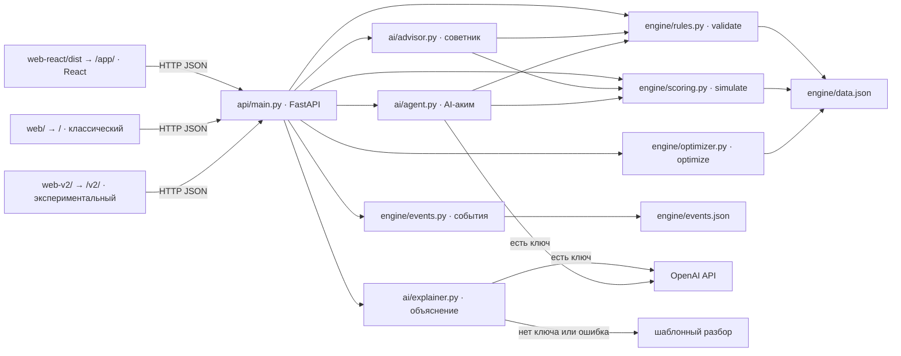

# Аким на 5 часов

Учебный AI-симулятор управления Астаной. Пользователь выбирает ровно пять мер из четырнадцати при бюджете 100, движок пересчитывает десять показателей в пяти районах и выводит Astana Quality of Life Score, а AI объясняет готовый результат словами.

Кейс «Аким на 5 часов» (Astana Innovations), HackAlem AI, команда DEVour.

## 1. Описание и назначение

**Проблема.** Бюджета хватает на малую часть городских нужд, а рост среднего показателя может уживаться с деградацией отдельного района. Симулятор делает этот компромисс измеримым: Score на 70 % складывается из среднего по городу, на 30 % — из оценки самого слабого района, и штрафуется за каждый критический показатель (ниже 40).

**Для кого.** Для городских управленцев и аналитиков, которым нужно сравнить сценарии распределения ограниченного бюджета до принятия решений; для студентов и преподавателей как учебный стенд по городскому планированию.

**Что делает.**
- Показывает исходное состояние пяти районов и базовый Score **52,56**.
- Проверяет набор мер по восьми правилам и объясняет каждое нарушение на русском.
- Считает результат: эффекты с лагом, синергии, вклад каждой меры, критические показатели.
- Объясняет результат через OpenAI, а без ключа — шаблонным разбором из тех же чисел.
- Даёт советника (перебор замены одной меры с проверкой движком), оптимизатор (полный перебор допустимых наборов), пять городских событий с урезанием бюджета и AI-акима, который подбирает набор инструментами `validate_plan` / `simulate_plan`.

## 2. Архитектура



Принцип: **числа считает только движок, AI их объясняет.** `engine/` не знает ни про HTTP, ни про OpenAI и использует только стандартную библиотеку. `api/main.py` вызывает движок, округляет ответ до двух знаков и передаёт уже посчитанный результат в `ai/`. Модель не вычисляет Score и не предлагает наборы «от себя»: советник проверяет каждое предложение через `validate` и `simulate`, а AI-аким получает движок в виде инструментов и обязан прогнать любой план через них. Числа в текстах модели сверяются с результатами инструментов; неподтверждённые предложения удаляются, при повторной ошибке включается шаблонный разбор. Поэтому при недоступном AI цифры не меняются — меняется только текст.

## 3. Технологии и сторонние компоненты

| Компонент | Версия | Где используется |
| --- | --- | --- |
| FastAPI | 0.141.1 | `api/main.py`: маршруты, валидация тел, 422 |
| Uvicorn | 0.53.0 | ASGI-сервер: `run.sh`, Dockerfile, ручной запуск |
| OpenAI Python SDK | 3.19.0 | `ai/explainer.py`, `ai/agent.py`: Chat Completions, `response_format`, вызов функций |
| python-dotenv | 1.2.3 | `api/main.py`: чтение `.env` |
| httpx | 0.28.1 | Транспорт `fastapi.testclient` в тестах |
| pytest | 9.1.1 | Все тесты |
| Starlette, Pydantic | ставятся с FastAPI | `StaticFiles`, `TestClient`; модели запросов |
| React, React DOM | 19 | `web-react/` — основной интерфейс `/app/` |
| Vite, @vitejs/plugin-react | 7 / 5 | Сборка `web-react/dist` |
| Tailwind CSS, @tailwindcss/vite | 4 | Стили `/app/` |
| framer-motion | 12 | Анимации `/app/` |
| lucide-react | 0.544 | Иконки `/app/` |
| Google Fonts: Onest | — | Интерфейс во всех трёх витринах |
| Google Fonts: Manrope | — | Крупные заголовки, Score, надпись «АСТАНА» |
| Модель OpenAI | из `OPENAI_MODEL`, по умолчанию в коде `gpt-6-sol` | Объяснение, сравнение сценариев, AI-аким |

Точные версии Python-пакетов зафиксированы в `requirements.txt`, JavaScript-пакетов — в `web-react/package-lock.json`. С внешних адресов подключаются только шрифты (`fonts.googleapis.com`, `fonts.gstatic.com`); при недоступности сети интерфейс переходит на системный шрифт и продолжает работать. Других CDN, библиотек графиков или карт нет.

**Происхождение данных.** Районы, десять показателей, веса, 14 мер, синергии и несовместимости — синтетический датасет из материалов кейса Astana Innovations, перенесённый в `engine/data.json` без изменений. Пять событий EV1–EV5 в `engine/events.json` придуманы командой. Изображения в `web-react/public/assets/` и `web-v2/assets/` сгенерированы командой с помощью AI (ChatGPT) для этого проекта — это не документальные фотографии и не чужая графика.

## 4. Установка и запуск

Одной командой (macOS или Linux):

```bash
./run.sh
```

Скрипт создаёт `.venv`, если её нет, ставит зависимости из `requirements.txt`, копирует `.env.example` в `.env`, если `.env` отсутствует, и запускает `uvicorn api.main:app` на http://localhost:8000/app/. Порт переопределяется: `PORT=9000 ./run.sh`.

Вручную:

```bash
python3 -m venv .venv
source .venv/bin/activate
python3 -m pip install -r requirements.txt
cp .env.example .env
python3 -m uvicorn api.main:app --reload
```

Через Docker (Python на машине не нужен):

```bash
docker build -t akim-simulator .
docker run --rm -p 8000:8000 akim-simulator
docker run --rm -p 8000:8000 --env-file .env akim-simulator
```

Образ на `python:3.12-slim`; `.env` в образ не попадает, ключ передаётся при запуске через `--env-file .env` или `-e OPENAI_API_KEY=...`.

**npm для запуска не нужен**: собранный React-интерфейс `web-react/dist` закоммичен и отдаётся сервером на `/app/`. Пересборка фронта нужна только после правок в `web-react/src`:

```bash
cd web-react && npm ci && npm run build
```

Развёрнутой публичной версии нет — проект запускается локально одной командой.

## 5. Зависимости и системные требования

- Python 3.11 или новее (проверено на 3.12 и 3.14) и pip.
- Для Docker — Docker Desktop или Docker Engine.
- Для пересборки фронта — Node.js 20 или новее и npm; `node_modules` в репозиторий не входит.
- Сеть нужна только для установки зависимостей, Google Fonts и обращений к OpenAI; расчёты работают офлайн.

## 6. Переменные окружения и работа без ключа

`.env.example` содержит две переменные:

| Переменная | Назначение |
| --- | --- |
| `OPENAI_API_KEY` | Ключ OpenAI; необязателен |
| `OPENAI_MODEL` | Модель для объяснения и AI-акима; по умолчанию `gpt-6-sol` |

Без ключа, при ошибке обращения к API или некорректном ответе модели сервер использует шаблонный разбор из тех же чисел движка и помечает ответ `source: "fallback"`; AI-аким в этом случае возвращает план оптимизатора. Расчёты, валидация, события, сравнение и оптимизатор от ключа не зависят. Пакет `openai` должен быть установлен в любом случае. `.env` в git не добавляется.

## 7. Интерфейсы

| Путь | Что это |
| --- | --- |
| `/app/` | **Основной интерфейс** на React: hero «АСТАНА», решения со слотами и панелью бюджета, результат с кольцом Score и AI-анализом, события, AI-аким, оптимизатор |
| `/` | Классический интерфейс без сборки (`web/`): те же сценарии, печатный отчёт, тепловые карты |
| `/v2/` | Экспериментальная витрина на фотографиях (`web-v2/`), использует `web/app.js` |
| `/api/*` | JSON API, описано в `docs/API.md` |

Все три витрины ходят в один API и показывают одни и те же числа.

| Метод и путь | Назначение |
| --- | --- |
| `GET /api/state` | Бюджет, районы с базовой оценкой, меры, веса, базовый Score |
| `GET /api/events` | Пять событий |
| `POST /api/validate` | Проверка `{ "decisions": [...], "event_id": null }` → `valid`, `errors`, `total_cost`, `budget`, `budget_left` |
| `POST /api/simulate` | Расчёт валидного набора; невалидный → 422 с причинами |
| `POST /api/explain` | Симуляция, анализ AI и `source` |
| `POST /api/compare` | Сравнение сценариев `{ "scenarios": [{ "name", "decisions", "event_id" }] }` |
| `GET /api/optimize?top=5&event_id=EV1` | Лучшие наборы, `top` от 1 до 100 |
| `POST /api/agent` | AI-аким: `{ "goal": str \| null, "event_id": str \| null }` → `decisions`, `simulation`, `steps`, `explanation`, `source` |

Решение: `{ "measure_id": "M7", "district": "Нура" }`, для городских мер `"district": null`. `event_id` необязателен везде; неизвестный даёт 422. Все числа в ответах округлены до двух знаков, внутри движок считает без округления.

```bash
curl -s http://localhost:8000/api/simulate \
  -H 'Content-Type: application/json' \
  -d '{"decisions": [
        {"measure_id": "M7", "district": "Нура"},
        {"measure_id": "M8", "district": "Нура"},
        {"measure_id": "M10", "district": "Нура"},
        {"measure_id": "M12", "district": null},
        {"measure_id": "M5", "district": "Сарыарка"}
      ]}'
```

Ответ содержит `"score": 56.54`, `"base_score": 52.56`, `"total_cost": 95`.

## 8. Модель: данные, формула, события

Бюджет 100, горизонт 8 кварталов, показатели 0–100 (больше — лучше). Веса: T1 0,10, T2 0,10, E1 0,09, E2 0,11, S1 0,11, S2 0,11, B1 0,09, B2 0,09, C1 0,10, C2 0,10.

| Район | Доля населения | Базовая оценка | T1 | T2 | E1 | E2 | S1 | S2 | B1 | B2 | C1 | C2 |
| --- | --- | --- | --- | --- | --- | --- | --- | --- | --- | --- | --- | --- |
| Есиль | 0.27 | 62.99 | 45 | 62 | 68 | 72 | 48 | 55 | 78 | 60 | 75 | 70 |
| Алматы | 0.24 | 57.06 | 40 | 75 | 50 | 55 | 60 | 65 | 62 | 52 | 50 | 60 |
| Сарыарка | 0.2 | 54.65 | 50 | 70 | 42 | 40 | 62 | 68 | 58 | 55 | 45 | 55 |
| Байконур | 0.13 | 56.63 | 52 | 68 | 55 | 50 | 58 | 60 | 52 | 58 | 55 | 58 |
| Нура | 0.16 | 49.18 | 55 | 40 | 45 | 65 | 38 | 35 | 55 | 50 | 60 | 50 |

Городская мера действует на все пять районов, районная — на выбранный. Лаг в кварталах уменьшает эффект множителем `(8 − лаг) / 8`.

| ID | Направление | Название | Тип | Стоимость | Лаг | Эффекты |
| --- | --- | --- | --- | --- | --- | --- |
| M1 | Транспорт | Выделенные полосы для автобусов | один район | 18 | 2 | T1 +6, T2 +9 |
| M2 | Транспорт | Умные светофоры | весь город | 22 | 2 | T1 +4, B2 +3 |
| M3 | Транспорт | Линия ЛРТ | один район | 30 | 4 | T1 +16, T2 +20, E2 +4 |
| M4 | Экология | Парк / сквер | один район | 15 | 2 | E1 +12, E2 +3, B1 +2 |
| M5 | Экология | Перевод частного сектора на чистое топливо | один район | 25 | 3 | E2 +14, C1 +4 |
| M6 | Экология | Городская программа озеленения | весь город | 20 | 4 | E1 +5, E2 +3 |
| M7 | Соцсфера | Школа + детсад | один район | 24 | 3 | S1 +16 |
| M8 | Соцсфера | Центр семейного здоровья | один район | 20 | 3 | S2 +14 |
| M9 | Соцсфера | Дворовые спорт-хабы | один район | 10 | 1 | S1 +3, S2 +3, B1 +3 |
| M10 | Безопасность | Освещение и камеры | один район | 12 | 1 | B1 +12, B2 +2 |
| M11 | Безопасность | Безопасные переходы и школьные зоны | один район | 10 | 1 | B2 +12, T1 -2 |
| M12 | Сервисы | Единая цифровая платформа обращений | весь город | 14 | 1 | C2 +5 |
| M13 | Сервисы | Модернизация тепло- и водосетей | один район | 28 | 4 | C1 +18, E2 +2 |
| M14 | Сервисы | Аварийные бригады ЖКХ | весь город | 16 | 1 | C1 +5, C2 +2 |

Синергии (обе меры выбраны, бонус в районе первой, лагом не масштабируется): M1 + M2 → T1 +2; M10 + M12 → B1 +2; M5 + M6 → E2 +2. Несовместимости: M1 и M3 в любых районах; M4 и M7 в одном районе; M5 и M13 в одном районе.

```text
I'_dk = clip(I_dk + Σ эффект_mk × (8 − L_m) / 8 + синергии, 0, 100)
D_d = Σ w_k × I'_dk
D_avg = Σ pop_d × D_d
Score = 0,7 × D_avg + 0,3 × min(D_d) − N_crit
```

`N_crit` — число пар «район × показатель» со значением строго ниже 40 после эффектов.

Правила валидации: сумма стоимостей ≤ бюджета; ровно 5 мер; без повторов; для районной меры район обязателен и из списка, для городской — `null`; не более 2 мер одного направления; несовместимости запрещены; невалидный набор не получает Score, а только список причин; порядок мер не важен.

События ухудшают исходные показатели до мер (лагом не масштабируются) и забирают часть бюджета на ликвидацию: доступный бюджет = 100 − штраф.

| ID | Событие | Где | Эффекты | Штраф бюджета | Доступный бюджет | Базовый Score |
| --- | --- | --- | --- | --- | --- | --- |
| EV1 | Прорыв теплосети | Алматы | C1 -18, C2 -8 | −12 | 88 | 51.12 |
| EV2 | Смоговый эпизод | Сарыарка | E2 -12 | −8 | 92 | 51.37 |
| EV3 | Рост числа ДТП у школ | Нура | B2 -14 | −5 | 95 | 51.04 |
| EV4 | Наплыв новосёлов и переполнение школ | Есиль | S1 -12, T1 -8 | −10 | 90 | 50.16 |
| EV5 | Авария на мосту | весь город | T1 -10 | −15 | 85 | 49.56 |

## 9. Порядок проверки основного сценария

Запустите сервер и откройте http://localhost:8000/app/. Все числа — фактические ответы API.

1. **Город.** Score **52,56**, бюджет **100**. Полоса районов: Есиль 62,99, Алматы 57,06, Сарыарка 54,65, Байконур 56,63, Нура 49,18 — у Нуры два критических показателя (школы 38, поликлиники 35).
2. **Решения → «Демо-сценарий».** Набор M7 Нура, M8 Нура, M10 Нура, M12 город, M5 Сарыарка: выбрано **95** из 100, остаток **5**, пять слотов заполнены, «Набор готов к расчёту». Если снять галочку и выбрать шестую меру, панель покажет причины из `/api/validate`.
3. **Рассчитать.** Score **52,56 → 56,54**, дельта **+3,98 балла**, критических показателей **0**, слабейший район Нура **52,96**; у Нуры школы 38 → 48, поликлиники 35 → 43,75. Вклады: M7 +1,45, M8 +1,40, M10 +0,53, M12 +0,51, M5 +0,17; синергия M10 + M12 → B1 +2 в Нуре. Ниже — «Записка советника» с бейджем «Анализ AI» (с ключом) или «Шаблонный анализ» (без ключа) и рекомендации с кнопкой «Применить»; первая — заменить M5 на M3 в Нуре, Score **57,21** при стоимости 100.
4. **Событие «Прорыв теплосети» (EV1).** Бюджет **100 → 88**, базовый Score с событием **51,12**. На экране решений тот же демо-набор становится невалидным: «Стоимость набора 95 превышает бюджет 88 на 7: из-за события «Прорыв теплосети» на ликвидацию ушло 12 из 100», кнопка расчёта заблокирована.
5. **Оптимизатор.** При EV1 лучший набор **56,09** за 86 (M8, M9, M10 в Нуре, M13 в Алматы, M14 город). Без события — **57,24** за 98 (M2 город, M3 Нура, M8 Нура, M9 Нура, M14 город). Любой набор загружается в решения.
6. **AI-аким.** Цель «подтянуть Нуру» → с ключом ответ за 10–20 секунд, `source: "ai"`, около десяти настоящих шагов `validate` / `simulate`, итоговый набор валиден, «План действий» с кнопкой «Применить сценарий». Без ключа — план оптимизатора и `source: "fallback"`.

Тот же сценарий воспроизводится на `/` и `/v2/` с теми же числами.

## 10. Тесты

```bash
.venv/bin/python -m pytest -q
```

**237 тестов**, все проходят без сети: 99 в `tests/test_engine.py` (контрольные числа, восемь правил, события, устойчивость к некорректному вводу, оптимизатор), 96 в `tests/test_api.py` (все эндпоинты через `fastapi.testclient`, события, кривые запросы → 422, округление, `/api/agent`), 14 в `tests/test_ai.py` (объяснение и AI-аким с подменённым клиентом OpenAI: повтор, fallback, лимит инструментов, выдуманные числа) и 28 в `ai/test_numeric_grounding.py` (защита от выдуманных чисел). Запускать нужно через `python -m pytest`: голый `pytest` не добавляет корень репозитория в `sys.path`. Workflow `.github/workflows/tests.yml` запускается вручную из вкладки Actions (Python 3.12, тот же прогон с пустым ключом).

## 11. Ограничения

- Учебная модель с фиксированными данными, линейными эффектами и заданными лагами — не прогноз реального развития Астаны.
- Расчёт даёт состояние на горизонте восьми кварталов без поквартальной динамики; события задаются вручную по одному.
- Оптимизатор максимизирует только формулу Score; кэш живёт в памяти процесса.
- Нет аккаунтов и базы данных; сохранённые сценарии живут в памяти вкладки до перезагрузки.
- AI может быть недоступен — тогда включается шаблонный разбор, который явно помечается; рекомендации советника перебирают замену одной меры и не гарантируют глобальный оптимум.
- Отчёт в классическом интерфейсе — печатная страница браузера, выгрузки в CSV или JSON нет.

Подробности: описание API — `docs/API.md`, сценарии проверки и известные ограничения — `docs/QA.md`, правила разработки и контракт между модулями — `AGENTS.md`.
